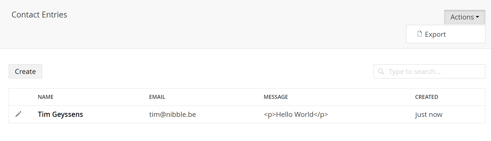

# UIOMatic-Addons-Export
Addon for [UI-O-Matic](https://github.com/TimGeyssens/UIOMatic) to allow exporting of List View data

##Usage##
Just populate the ListViewActions parameter on your UIOMatic attribute with the Actions you wish to supply
    
    ListViewActions = new[]{ typeof(ExportAction)})]

Now you should get an addditional actions dropdown with the Export option

##Full Example##

    using System;
    using System.ComponentModel.DataAnnotations;
    using UIOMatic.Attributes;
    using UIOMatic.Enums;
    using UIOMaticAddons.Export;
    using Umbraco.Core.Persistence;
    using Umbraco.Core.Persistence.DatabaseAnnotations;

	namespace TestUIOMaticExport.Models{
 
    [TableName("ContactEntries")]
    [PrimaryKey("Id", autoIncrement = true)]
    [UIOMatic("contactentries", "Contact Entries", "Contact Entry", 
        FolderIcon = "icon-users",
        SortColumn = "Created", SortOrder = "desc",
        RenderType = UIOMaticRenderType.List,
        ListViewActions = new[]{ typeof(ExportAction)})]
    public class ContactEntry
    {
        [PrimaryKeyColumn(AutoIncrement = true)]
        public int Id { get; set; }

        [Required]
        [UIOMaticListViewField]
        [UIOMaticField]
        public string Name { get; set; }

        [Required]
        [EmailAddress]
        [UIOMaticListViewField]
        [UIOMaticField]
        public string Email { get; set; }

        [SpecialDbType(SpecialDbTypes.NTEXT)]
        [Required]
        [UIOMaticListViewField]
        [UIOMaticField(View = UIOMatic.Constants.FieldEditors.Rte)]
        public string Message { get; set; }

        [UIOMaticListViewField(Config = "{'format' : '{{value|relativeDate}}'}")]
        [UIOMaticField(View = UIOMatic.Constants.FieldEditors.DateTime)]
        public DateTime Created { get; set; }
    }
	}